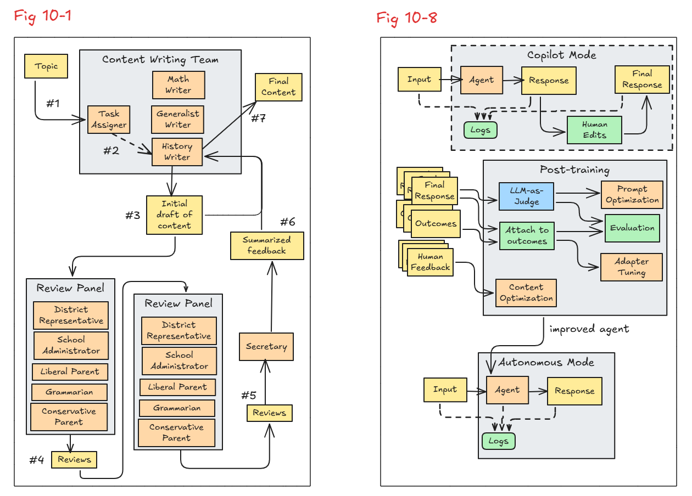

## Composable Patterns Application Architecture
You can use this as an example to build a multi-agent system using
simple composable patterns in an LLM- and cloud-agnostic way and
using primarily OSS components.

## Design
Use Pydantic AI for LLM-agnosticity
* Build: https://ai.pydantic.dev/multi-agent-applications/
* Prompt management (Jinja2): https://github.com/pydantic/pydantic-ai/issues/921#issuecomment-2813030935
* Logging: https://docs.python.org/3/library/logging.html

We control these horizontal services and make sure to log inputs and outputs so that we can post-train a SLM later
* Guardrails: see utils/guardrails.py (uses LLM-as-Judge approach) and agents/task_assigner.py for example usage
* Human feedback: see utils/human_feedback.py and pages/1_AssignToWriter.py for example usage
* Eval: see utils/save_for_eval.py and agents/task_assigner.py for example usage
* Memory: see utils/long_term_memory.py and pages/2_CreateDraft.py for example usage

Use commercial off-the-shelf (COTS) tools for monitoring, memory and optionally for guardrails and evaluation:
* Monitoring: https://pydantic.dev/logfire
* Memory: https://github.com/mem0ai/mem0
* Guardrails: https://github.com/guardrails-ai/guardrails (optional: Toxicity, etc. as second layer)

## How to run it locally
Clone the repo and make sure you don't check in your keys.env by mistake
```
git clone https://github.com/lakshmanok/generative-ai-design-patterns/
git update-index --assume-unchanged keys.env
```
Edit keys.env and add your Gemini API key to it (you don't need the others unless you plan to change LLMs):
```
GEMINI_API_KEY=AI...
```

----
### Step-by-step: Get a Gemini API key
1. Go to the Gemini API page
👉 https://makersuite.google.com/app

2. Sign in with your Google account
Make sure you’re using a supported region (Gemini may not be available in all countries yet).

3. Click "Get API Key" or go to:
👉 https://makersuite.google.com/app/apikey
---

Install the packages:
```
pip install -r requirements.txt 
```

Try out the command-line app:
``` 
python cmdline_app.py 
```

Suggested topics:
* Battle of the Bulge
* Solve: x=3 = 5

Try out the GUI interface:
``` 
streamlit run streamlit_app.py 
```

Check out the logs, configured in logging.json to save only the prompt texts:
``` cat evals.log ```

### Run containerized app locally
`docker build -t composable-app . && docker run -p 8080:8080 -e GEMINI_API_KEY=your-key composable-app`. 

Replace `your-key` with your actual Gemini API key.

## Deploy application
This is a Dockerized application; you can deploy it on
a serverless platform such as AWS Farsight or Google Cloud Run.

### Google Cloud Run
Before running the `deploy_to_cloud_run.sh` script, run the following commands to ensure everything is set up:

1. Authenticate with Google Cloud:
`gcloud auth login`

2. Set your project:
`gcloud config set project YOUR_PROJECT_ID`

3. Set your region:
`gcloud config set compute/region YOUR_REGION`

4. Enable required services:
`gcloud services enable run.googleapis.com cloudbuild.googleapis.com artifactregistry.googleapis.com`

5. Create the Artifact Registry repository (if not already created):
`gcloud artifacts repositories create composable-app-repo --repository-format=docker --location=YOUR_REGION`

6. `export GEMINI_API_KEY=your-key`

Replace `YOUR_PROJECT_ID` and `YOUR_REGION` with your actual project ID and region (e.g., `us-central1`). Replace `your-key` with your actual Gemini API key.

After these steps, you can run:
`bash deploy_to_cloud_run.sh`

If you run the script as `./deploy_to_cloud_run.sh` and get a "Permission denied" or similar error, you can fix this by running: `chmod +x deploy_to_cloud_run.sh`

<b>Note:</b> for greater security, you can keep your Gemini API key in the Google Cloud Secret Manager.


## How it works
The workflow (left) of this application and lifecycle (right) of how it is improved over time are depicted below:


All the prompts are in the prompts directory.
Look at the prompts and correlate them with the diagram above.

The code itself involves hooking up the workflow and using the right data structures.

A longer description is in Chapter 10 of the book Generative AI Design Patterns by Lakshmanan and Hapke, to be published October 2025

